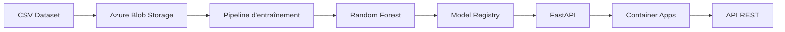

# Test technique : ML / MLOps Engineer

> **Pratique IA - SBI NORAM**
> Délai : **48h** à compter de la réception du sujet.
> Ce `README.md` est une **livrable à part entière** : soigne-le.
> Une partie des sujets MLOps (CI/CD, monitoring, drift, retraining, sécurité, IA responsable) **n'est pas demandée à l'écrit** : elle est abordée en entretien technique à l'oral.

---

## 1. Contexte

Une chaîne de distribution alimentaire québécoise cherche à anticiper les **ruptures de stock sur ses SKUs critiques**, avec un horizon de prévision de **3 jours**. L'équipe data interne est **peu mature** : les solutions livrées doivent donc être **robustes, documentées et maintenables**, par quelqu'un d'autre que toi.

Tu es mandaté·e pour poser les bases d'un pipeline ML bout-en-bout, de l'exploration des données jusqu'à l'architecture de déploiement cloud, en passant par le packaging et la mise en production du modèle.

---

## 2. Dataset

Un dataset CSV fictif (`stocks.csv`) est fourni :

- **~36 500 lignes** couvrant **365 jours** (année 2024)
- **20 SKUs × 5 magasins**

### Colonnes :

| Colonne | Description |
|---|---|
| `date` | Date d'observation |
| `sku_id` | Identifiant du produit |
| `store_id` | Identifiant du magasin |
| `sales_qty` | Quantité vendue ce jour-là |
| `stock_level` | Niveau de stock en fin de journée |
| `promotion_flag` | Indicateur de promotion (0/1) |
| `temperature` | Température extérieure (°C) |
| `day_of_week` | Jour de la semaine (0 = lundi) |
| `stockout_next_3d` | **Variable cible** : 1 si rupture dans les 3 prochains jours, 0 sinon |
| `stock_risk_score` | Score de risque de rupture |

> Le dataset contient **plusieurs anomalies volontaires**. À toi de les identifier et de les traiter.

---

## Partie 1 - Modélisation

### 1.1 Analyse exploratoire (EDA)

Identifie les **principales anomalies / problèmes** dans les données et décris précisément comment tu les traites (imputation, suppression, correction, exclusion de variable…). Justifie chaque décision.

### 1.2 Modèle de prévision

Entraîne le modèle de ton choix. Dans le `README.md`, **justifie ton choix** en tenant compte du contexte :

- horizon de prévision de 3 jours,
- volumétrie disponible,
- maturité technique faible de l'équipe cliente (qui devra maintenir le modèle).

### 1.3 Évaluation

Évalue ton modèle avec une **métrique adaptée au contexte business** (coût d'une rupture vs. coût d'un surstock). **Justifie le choix de la métrique**.

---

## Partie 2 - MLOps & mise en production

### 2.1 Structure du repo

Le code doit être organisé comme s'il partait en production :

```bash
.
├── src/
│   ├── preprocessing.py
│   ├── training.py
│   ├── evaluation.py
│   └── api.py
├── tests/
│   └── ...
├── Dockerfile
├── Makefile (ou run.sh)
├── requirements.txt (ou pyproject.toml)
└── README.md
```

Tu peux ajouter d'autres fichiers/dossiers selon ton organisation, mais cette structure minimale est attendue.

### 2.2 Packaging du modèle

Le modèle doit être **exposé via une API HTTP** (FastAPI, Flask ou équivalent) avec au minimum :

- un endpoint `POST /predict` qui prend en entrée une ou plusieurs observation(s) et renvoie la prédiction de rupture sur 3 jours (et idéalement la probabilité associée),
- un endpoint `GET /health` qui renvoie un statut `200 OK` quand l'API est prête.

L'API doit être **containerisée** via le `Dockerfile` fourni, et démarrable en une commande (`make run`, `docker run …`, etc.).

#### Contrat d'API minimal

Pour assurer la reproductibilité de la pré-évaluation automatique (cf. section *Pré-évaluation automatique* plus bas), respecte ce contrat minimal :

- **Port exposé** : `8000`
- **Tag d'image Docker** buildable via `docker build -t stockout-api:test .` (depuis la racine du repo)
- **Payload `POST /predict`** :

```json
{
  "instances": [
    {
      "date": "2024-12-15",
      "sku_id": "SKU_001",
      "store_id": "STORE_1",
      "sales_qty": 25,
      "stock_level": 10,
      "promotion_flag": 0,
      "temperature": 5.0,
      "day_of_week": 6
    }
  ]
}
```

- **Réponse attendue** : un JSON contenant les prédictions (format laissé à ton appréciation, mais documenté dans ton README).

Tu peux enrichir l'API avec d'autres endpoints / champs si tu le juges utile.

### 2.3 Tests unitaires

Au minimum **2 tests unitaires** pertinents (préprocessing, fonctions critiques, ou endpoint de l'API). Le choix de ce qui est testé est lui-même un signal, justifie-le brièvement.

### 2.4 Architecture de déploiement cloud

Décris dans le `README.md` comment tu déploierais ce modèle sur la plateforme cloud de ton choix. **Format au choix** :

- une liste de bullets,
- un schéma Mermaid intégré dans le README,
- une image (PNG/SVG) référencée dans le README.

---

## Modalités de soumission

- **Délai** : 48h à compter de la réception du sujet.
- **Stack** : Python 3.10+, librairies libres (scikit-learn, XGBoost, LightGBM, PyTorch, etc.).
- **Process Git attendu** :
  - Travail sur une **branche** dédiée (pas de commits directs sur `main`),
  - Commits atomiques avec messages clairs (Conventional Commits apprécié),
  - Livraison via **Pull Request** sur le repo, avec une description de PR soignée (résumé, choix techniques, points d'attention).
- **Format de livraison** : la livraison se fait par **Pull Request ouverte sur `main`**. La PR n'a pas besoin d'être mergée, elle sera revue en l'état. La structure de repo de la section 2.1 est obligatoire ; tu es libre d'ajouter ce que tu juges utile.
- **Reproductibilité** : ton code doit pouvoir être exécuté de bout en bout par une personne tierce avec les seules instructions du `README.md`.
- **Checks rouges** : la branche `main` est protégée et les checks de pré-évaluation sont obligatoires pour merger. Si certains checks restent rouges à la deadline, livre quand même ta PR : nous l'examinerons en l'état et les échecs ne sont pas éliminatoires en soi.

---

## Grille d'évaluation

Le test est noté sur 5 axes. Chaque axe est évalué indépendamment.

| Axe | Pondération | Ce qui est évalué |
|---|---|---|
| **1. Data Science** | 20 % | Qualité de l'EDA, détection des anomalies, choix du modèle, validation, métrique business, lucidité sur les pièges du dataset |
| **2. Qualité du code** | 20 % | Lisibilité, modularité, typage, gestion des erreurs, tests unitaires, respect de la structure de repo |
| **3. MLOps & industrialisation** | 30 % | Packaging API, Dockerfile, reproductibilité, gestion des dépendances, automatisation (Makefile/CI), versioning |
| **4. Architecture cloud** | 15 % | Pertinence et clarté du schéma de déploiement (ingestion, training, registry, serving, retraining) |
| **5. Communication** | 15 % | Qualité du `README.md`, justifications des choix, documentation, qualité de la PR (description, commits) |


**Posture attendue** : on ne cherche pas la solution parfaite, on cherche un·e ingénieur·e capable de **faire des choix justifiés, de prioriser sous contrainte de temps, et de livrer un travail propre, traçable et maintenable**.

---

> **À propos de l'utilisation d'outils d'IA**
>
> L'usage d'assistants IA (Copilot, Cursor, ChatGPT, Claude, etc.) est **autorisé** sur ce test, on ne va pas se cacher, c'est notre quotidien à tous aujourd'hui. Ce qui nous intéresse, ce n'est pas *si* tu en as utilisé, mais **comment** : qu'est-ce que tu lui as délégué, ce que tu as relu/corrigé, et ce que tu as choisi de faire toi-même.

Bonne chance.


---
---

---

# Réponse au test technique

## Présentation

Cette proposition répond au test technique ML / MLOps Engineer de SBI.

L'objectif n'était pas uniquement d'obtenir le meilleur score de prédiction, mais de construire une solution reproductible, robuste et facilement maintenable par une équipe ayant une faible maturité en Machine Learning.

Le projet a été développé selon une démarche proche d'un projet industriel :

1. Analyse exploratoire des données
2. Détection et traitement des anomalies
3. Feature Engineering
4. Comparaison de plusieurs modèles
5. Sélection du modèle le plus pertinent
6. Industrialisation du pipeline
7. Exposition du modèle via une API REST
8. Containerisation Docker
9. Tests unitaires

---

# Architecture du projet

```
.
├── src/
│   ├── api.py
│   ├── config.py
│   ├── evaluation.py
│   ├── inference.py
│   ├── preprocessing.py
│   ├── schemas.py
│   └── training.py
│
├── tests/
│   ├── test_api.py
│   └── test_preprocessing.py
│
├── notebooks/
│   └── exploratory_data_analysis.ipynb
│
├── models/
│   └── stockout_model.joblib
│
├── Dockerfile
├── Makefile
├── requirements.txt
└── README.md
```

---

# Décisions d'ingénierie

Les principaux choix techniques sont les suivants :

- séparation claire entre exploration, entraînement, inférence et API ;
- pipeline de preprocessing réutilisable entre l'entraînement et l'inférence ;
- suppression de toute fuite d'information (`stock_risk_score`) ;
- split chronologique afin d'éviter toute fuite temporelle ;
- modèle sérialisé avec Joblib ;
- API REST développée avec FastAPI ;
- containerisation avec Docker afin de garantir la reproductibilité ;
- tests unitaires sur les composants critiques.

---

# Analyse exploratoire (EDA)

L'analyse complète est disponible dans :

```
notebooks/exploratory_data_analysis.ipynb
```

Les principales anomalies identifiées sont :

- valeurs manquantes ;
- températures hors domaine physique ;
- présence d'une variable présentant une fuite d'information (`stock_risk_score`) ;
- variables catégorielles ;
- déséquilibre des classes ;
- distributions des variables continues ;
- corrélations entre variables ;
- analyse temporelle.

Chaque anomalie identifiée est documentée et justifiée dans le notebook.

---

# Prétraitement

Les traitements appliqués sont :

- conversion de la colonne `date` ;
- suppression de la variable présentant une fuite d'information ;
- remplacement des températures invalides par des valeurs manquantes ;
- imputation des valeurs manquantes ;
- création de nouvelles variables métier ;
- encodage des variables catégorielles.

Les variables dérivées ajoutées sont notamment :

- `sales_stock_gap`
- `days_of_stock`

---

# Choix du modèle

Plusieurs modèles ont été envisagés durant la phase d'expérimentation.

Le modèle retenu est :

**Random Forest Classifier**

Ce choix est motivé par :

- de très bonnes performances sur le jeu de données ;
- une excellente robustesse ;
- peu de prétraitement nécessaire ;
- une maintenance simple ;
- une bonne interprétabilité ;
- une industrialisation facile.

Dans le contexte présenté, la simplicité de maintenance a été privilégiée par rapport à un gain marginal de performance.

---

# Évaluation

Le coût métier d'une rupture de stock étant supérieur au coût d'un faux positif, l'évaluation s'est concentrée sur des métriques adaptées aux jeux de données déséquilibrés :

- Recall
- Precision
- F1-score
- PR-AUC

La PR-AUC est retenue comme métrique principale.

Résultats obtenus :

- Accuracy : **97 %**
- Recall : **99 %**
- Precision : **82 %**
- PR-AUC : **0.995**

---

# API REST

Deux endpoints sont exposés :

## GET /health

Retourne :

```json
{
  "status": "ok"
}
```

---

## POST /predict

Exemple de requête :

```json
{
  "instances": [
    {
      "date": "2024-12-15",
      "sku_id": "SKU_001",
      "store_id": "STORE_1",
      "sales_qty": 25,
      "stock_level": 10,
      "promotion_flag": 0,
      "temperature": 5.0,
      "day_of_week": 6
    }
  ]
}
```

Exemple de réponse :

```json
{
  "predictions": [
    {
      "stockout_prediction": 1,
      "stockout_probability": 0.9949
    }
  ]
}
```

---

# Tests unitaires

Les tests couvrent :

- le pipeline de preprocessing ;
- le feature engineering ;
- l'API `/health` ;
- l'API `/predict`.

Exécution :

```bash
python -m pytest tests -v
```

---

# Docker

Construction de l'image :

```bash
docker build -t stockout-api:test .
```

Lancement :

```bash
docker run -p 8000:8000 stockout-api:test
```

---

# Proposition d'architecture Cloud



Dans un contexte de production, cette architecture pourrait être enrichie avec :

- Azure Machine Learning ;
- CI/CD GitHub Actions ;
- Azure Container Registry ;
- monitoring du modèle ;
- détection du drift ;
- réentraînement automatique.

---

# Exécution

Créer l'environnement :

```bash
python -m venv .venv
```

Activer l'environnement :

```bash
source .venv/bin/activate
```

Installer les dépendances :

```bash
pip install -r requirements.txt
```

Entraîner le modèle :

```bash
python -m src.training
```

Lancer l'API :

```bash
uvicorn src.api:app --reload
```

---

# Améliorations futures

Les pistes d'amélioration identifiées sont :

- optimisation des hyperparamètres ;
- suivi du drift des données ;
- MLflow pour le versionnement des modèles ;
- Feature Store ;
- explicabilité avec SHAP ;
- monitoring Prometheus / Grafana ;
- déploiement Kubernetes.
