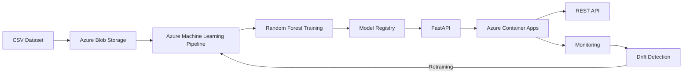

# Test technique : ML / MLOps Engineer

> **Pratique IA - SBI NORAM**
> Délai : **48h** à compter de la réception du sujet.
> Ce `README.md` est une **livrable à part entière** : soigne-le.
> Une partie des sujets MLOps (CI/CD, monitoring, drift, retraining, sécurité, IA responsable) **n'est pas demandée à l'écrit** : elle est abordée en entretien technique à l'oral.

---

## 1. Contexte

Une chaîne de distribution alimentaire québécoise cherche à anticiper les **ruptures de stock sur ses SKUs critiques**, avec un horizon de prévision de **3 jours**. L'équipe data interne est **peu mature** : les solutions livrées doivent donc être **robustes, documentées et maintenables**, par quelqu'un d'autre que toi.

Tu es mandaté·e pour poser les bases d'un pipeline ML bout-en-bout, de l'exploration des données jusqu'à l'architecture de déploiement cloud, en passant par le packaging et la mise en production du modèle.

---

## 2. Dataset

Un dataset CSV fictif (`stocks.csv`) est fourni :

- **~36 500 lignes** couvrant **365 jours** (année 2024)
- **20 SKUs × 5 magasins**

### Colonnes :

| Colonne | Description |
|---|---|
| `date` | Date d'observation |
| `sku_id` | Identifiant du produit |
| `store_id` | Identifiant du magasin |
| `sales_qty` | Quantité vendue ce jour-là |
| `stock_level` | Niveau de stock en fin de journée |
| `promotion_flag` | Indicateur de promotion (0/1) |
| `temperature` | Température extérieure (°C) |
| `day_of_week` | Jour de la semaine (0 = lundi) |
| `stockout_next_3d` | **Variable cible** : 1 si rupture dans les 3 prochains jours, 0 sinon |
| `stock_risk_score` | Score de risque de rupture |

> Le dataset contient **plusieurs anomalies volontaires**. À toi de les identifier et de les traiter.

---

## Partie 1 - Modélisation

### 1.1 Analyse exploratoire (EDA)

Identifie les **principales anomalies / problèmes** dans les données et décris précisément comment tu les traites (imputation, suppression, correction, exclusion de variable…). Justifie chaque décision.

### 1.2 Modèle de prévision

Entraîne le modèle de ton choix. Dans le `README.md`, **justifie ton choix** en tenant compte du contexte :

- horizon de prévision de 3 jours,
- volumétrie disponible,
- maturité technique faible de l'équipe cliente (qui devra maintenir le modèle).

### 1.3 Évaluation

Évalue ton modèle avec une **métrique adaptée au contexte business** (coût d'une rupture vs. coût d'un surstock). **Justifie le choix de la métrique**.

---

## Partie 2 - MLOps & mise en production

### 2.1 Structure du repo

Le code doit être organisé comme s'il partait en production :

```bash
.
├── src/
│   ├── preprocessing.py
│   ├── training.py
│   ├── evaluation.py
│   └── api.py
├── tests/
│   └── ...
├── Dockerfile
├── Makefile (ou run.sh)
├── requirements.txt (ou pyproject.toml)
└── README.md
```

Tu peux ajouter d'autres fichiers/dossiers selon ton organisation, mais cette structure minimale est attendue.

### 2.2 Packaging du modèle

Le modèle doit être **exposé via une API HTTP** (FastAPI, Flask ou équivalent) avec au minimum :

- un endpoint `POST /predict` qui prend en entrée une ou plusieurs observation(s) et renvoie la prédiction de rupture sur 3 jours (et idéalement la probabilité associée),
- un endpoint `GET /health` qui renvoie un statut `200 OK` quand l'API est prête.

L'API doit être **containerisée** via le `Dockerfile` fourni, et démarrable en une commande (`make run`, `docker run …`, etc.).

#### Contrat d'API minimal

Pour assurer la reproductibilité de la pré-évaluation automatique (cf. section *Pré-évaluation automatique* plus bas), respecte ce contrat minimal :

- **Port exposé** : `8000`
- **Tag d'image Docker** buildable via `docker build -t stockout-api:test .` (depuis la racine du repo)
- **Payload `POST /predict`** :

```json
{
  "instances": [
    {
      "date": "2024-12-15",
      "sku_id": "SKU_001",
      "store_id": "STORE_1",
      "sales_qty": 25,
      "stock_level": 10,
      "promotion_flag": 0,
      "temperature": 5.0,
      "day_of_week": 6
    }
  ]
}
```

- **Réponse attendue** : un JSON contenant les prédictions (format laissé à ton appréciation, mais documenté dans ton README).

Tu peux enrichir l'API avec d'autres endpoints / champs si tu le juges utile.

### 2.3 Tests unitaires

Au minimum **2 tests unitaires** pertinents (préprocessing, fonctions critiques, ou endpoint de l'API). Le choix de ce qui est testé est lui-même un signal, justifie-le brièvement.

### 2.4 Architecture de déploiement cloud

Décris dans le `README.md` comment tu déploierais ce modèle sur la plateforme cloud de ton choix. **Format au choix** :

- une liste de bullets,
- un schéma Mermaid intégré dans le README,
- une image (PNG/SVG) référencée dans le README.

---

## Modalités de soumission

- **Délai** : 48h à compter de la réception du sujet.
- **Stack** : Python 3.10+, librairies libres (scikit-learn, XGBoost, LightGBM, PyTorch, etc.).
- **Process Git attendu** :
  - Travail sur une **branche** dédiée (pas de commits directs sur `main`),
  - Commits atomiques avec messages clairs (Conventional Commits apprécié),
  - Livraison via **Pull Request** sur le repo, avec une description de PR soignée (résumé, choix techniques, points d'attention).
- **Format de livraison** : la livraison se fait par **Pull Request ouverte sur `main`**. La PR n'a pas besoin d'être mergée, elle sera revue en l'état. La structure de repo de la section 2.1 est obligatoire ; tu es libre d'ajouter ce que tu juges utile.
- **Reproductibilité** : ton code doit pouvoir être exécuté de bout en bout par une personne tierce avec les seules instructions du `README.md`.
- **Checks rouges** : la branche `main` est protégée et les checks de pré-évaluation sont obligatoires pour merger. Si certains checks restent rouges à la deadline, livre quand même ta PR : nous l'examinerons en l'état et les échecs ne sont pas éliminatoires en soi.

---

## Grille d'évaluation

Le test est noté sur 5 axes. Chaque axe est évalué indépendamment.

| Axe | Pondération | Ce qui est évalué |
|---|---|---|
| **1. Data Science** | 20 % | Qualité de l'EDA, détection des anomalies, choix du modèle, validation, métrique business, lucidité sur les pièges du dataset |
| **2. Qualité du code** | 20 % | Lisibilité, modularité, typage, gestion des erreurs, tests unitaires, respect de la structure de repo |
| **3. MLOps & industrialisation** | 30 % | Packaging API, Dockerfile, reproductibilité, gestion des dépendances, automatisation (Makefile/CI), versioning |
| **4. Architecture cloud** | 15 % | Pertinence et clarté du schéma de déploiement (ingestion, training, registry, serving, retraining) |
| **5. Communication** | 15 % | Qualité du `README.md`, justifications des choix, documentation, qualité de la PR (description, commits) |


**Posture attendue** : on ne cherche pas la solution parfaite, on cherche un·e ingénieur·e capable de **faire des choix justifiés, de prioriser sous contrainte de temps, et de livrer un travail propre, traçable et maintenable**.

---

> **À propos de l'utilisation d'outils d'IA**
>
> L'usage d'assistants IA (Copilot, Cursor, ChatGPT, Claude, etc.) est **autorisé** sur ce test, on ne va pas se cacher, c'est notre quotidien à tous aujourd'hui. Ce qui nous intéresse, ce n'est pas *si* tu en as utilisé, mais **comment** : qu'est-ce que tu lui as délégué, ce que tu as relu/corrigé, et ce que tu as choisi de faire toi-même.

Bonne chance.


---
---
---
---

# Réponse au test technique

## Présentation

Cette proposition répond au test technique ML / MLOps Engineer de SBI. L'objectif n'était pas uniquement d'obtenir le meilleur score de prédiction, mais de construire une solution reproductible, robuste et maintenable par une équipe ayant une faible maturité en Machine Learning.

Démarche suivie : EDA → détection et traitement des anomalies → preprocessing incluant feature engineering justifié par les résultats de l'EDA → comparaison de 2 modèles → sélection argumentée du modèle adéquat → industrialisation (API, tests, Docker) → architecture cloud cible.

---

## Hypothèses

- une observation correspond à l'état d'un SKU dans un magasin à une date donnée ;
- aucune information future n'est disponible au moment de la prédiction ;
- les variables disponibles sont les seules utilisables en production ;
- la cible `stockout_next_3d` est considérée comme correctement construite.

### Dataset

Un dataset CSV fictif (`stocks.csv`) est fourni :

- **~36 500 lignes** couvrant **365 jours** (année 2024)
- **20 SKUs × 5 magasins**

| Colonne | Description |
|---|---|
| `date` | Date d'observation |
| `sku_id` | Identifiant du produit |
| `store_id` | Identifiant du magasin |
| `sales_qty` | Quantité vendue ce jour-là |
| `stock_level` | Niveau de stock en fin de journée |
| `promotion_flag` | Indicateur de promotion (0/1) |
| `temperature` | Température extérieure (°C) |
| `day_of_week` | Jour de la semaine (0 = lundi) |
| `stockout_next_3d` | **Variable cible** : 1 si rupture dans les 3 prochains jours, 0 sinon |
| `stock_risk_score` | Score de risque de rupture |

---

# Architecture du projet

```
.
├── src/
│   ├── api.py
│   ├── config.py
│   ├── evaluation.py
│   ├── inference.py
│   ├── preprocessing.py
│   ├── schemas.py
│   └── training.py
│
├── tests/
│   ├── test_api.py
│   └── test_preprocessing.py
│
├── notebooks/
│   └── exploratory_data_analysis.ipynb
│
├── Dockerfile
├── Makefile
├── pytest.ini
├── requirements.txt
└── README.md
```

Le dossier `models/` n'est **pas versionné** (`.gitignore`) : le modèle est entraîné automatiquement pendant le build Docker (voir section Docker), pour garantir qu'il reste toujours cohérent avec le code source qu'il accompagne.

---

## 1.1 Analyse exploratoire (EDA)

Analyse complète dans `notebooks/exploratory_data_analysis.ipynb`. Résumé des anomalies identifiées, avec leur ampleur réelle mesurée et leur traitement :

| Anomalie | Ampleur mesurée | Traitement |
|---|---|---|
| Valeurs manquantes (`sales_qty`, `temperature`) | 5.0% chacune | Imputation — détail en section *Prétraitement* |
| `temperature` hors domaine physique [-40, 40] | 0.56% (203 lignes réelles) | Mise à NaN puis imputation |
| `sales_qty > stock_level` | 25.9% des lignes | Conservé et transformé en feature (`demand_exceeds_stock`) : signal métier majeur, taux de rupture associé de **52.6%** contre **0.9%** sinon (x58) |
| `stock_risk_score` — fuite de données | Corrélation r = 1.000 (globale), r = 0.9996 par magasin pris séparément, 100% de concordance par simple seuillage | **Exclusion définitive**, implémentée dans le code (`DROPPED_COLUMNS` de `preprocessing.py`) et non simplement documentée, pour garantir qu'elle ne soit jamais réintroduite accidentellement |
| Déséquilibre de classes | 14.32% de ruptures (5 225 / 36 500) | Split chronologique + métriques adaptées (Recall/Precision/F1/PR-AUC plutôt qu'accuracy) |
| Pouvoir prédictif des variables (corrélation point-bisériale) | `stock_level` : -0.548 (p<0.0001) · `sales_qty` : +0.112 (p<0.0001) · `temperature` : -0.003 (p=0.55, non significatif) | `stock_level`/`sales_qty` confirmées comme features fortes ; `temperature` conservée à faible coût malgré l'absence de signal démontré |
| Multicolinéarité | Aucune corrélation forte entre `stock_level`, `sales_qty`, `temperature`, `promotion_flag` | Aucune action nécessaire |

---

## Prétraitement & Feature Engineering

- Conversion de `date` en datetime.
- Correction des `temperature` hors domaine physique (NaN puis imputation).
- Encodage one-hot de `sku_id` / `store_id`.
- Suppression de `stock_risk_score` (fuite de données confirmée, voir tableau ci-dessus).

**Stratégie d'imputation** : les statistiques sont calculées **uniquement sur le jeu d'entraînement**, puis sauvegardées avec le modèle et réutilisées telles quelles à l'inférence — jamais recalculées sur les nouvelles données. Cela évite toute fuite d'information et garantit un comportement stable même quand une requête `/predict` ne contient qu'une seule observation (une moyenne calculée sur un batch d'une seule ligne contenant un NaN produirait un NaN — ce bug a été identifié en cours de développement, voir §2.3). La statistique retenue dépend de la distribution observée en EDA :
- **Moyenne** pour `sales_qty` et `temperature` (distributions suffisamment régulières) ;
- **Médiane** pour `days_of_stock` (distribution fortement asymétrique — quelques valeurs très élevées en cas de faibles ventes couplées à un stock important).

Les variables dérivées ne sont pas arbitraires : elles découlent directement des observations de l'EDA.

| Feature | Justification |
|---|---|
| **`demand_exceeds_stock`** | L'EDA a montré que lorsque `sales_qty > stock_level`, le taux de rupture passe d'environ 0,9 % à 52,6 %. Cette variable binaire synthétise ce signal très discriminant. |
| **`sales_stock_gap`** | Deux observations peuvent avoir `sales_qty > stock_level` avec des déficits très différents (1 unité vs 20 unités). Cette variable quantifie l'ampleur du déficit, information que la variable binaire seule ne capture pas. |
| **`days_of_stock`** | Estime le nombre de jours durant lesquels le stock actuel peut satisfaire la demande au rythme observé (`stock_level / sales_qty`). Directement aligné avec l'horizon métier de 3 jours. |

---

## 1.2 Choix du modèle

Le choix ne s'est pas limité à la performance brute. Il tient compte du contexte : horizon de prédiction de 3 jours, volume modeste (~36 500 observations), délai de 48h, et surtout une **équipe cliente peu mature en Data Science/MLOps** nécessitant une solution explicable et maintenable.

Deux familles de modèles ont été comparées :
- **Logistic Regression** : baseline simple, rapide, interprétable ;
- **Random Forest** : capture les relations non linéaires et interactions entre variables, sans prétraitement complexe.

> Le tableau suivant correspond à la **phase de sélection du modèle**, réalisée avant l'ajout de la feature `demand_exceeds_stock` (ajoutée ensuite, voir §1.3 "Impact du Feature Engineering"). Les chiffres finaux du modèle retenu, avec le pipeline complet, sont donnés en §1.3.

| Modèle | Recall | Precision | F1-score | Faux négatifs | Faux positifs |
|---|---:|---:|---:|---:|---:|
| Logistic Regression | 0.98 | 0.80 | 0.88 | 17 | 215 |
| Random Forest | 0.96 | 0.95 | 0.95 | 38 | 39 |

### Pourquoi pas la régression logistique ?

Excellente baseline, mais repose sur une relation essentiellement linéaire — or l'EDA a montré des interactions plus complexes (stock, ventes, promotions, variables dérivées) mieux capturées par un modèle à base d'arbres. Surtout, malgré un recall légèrement supérieur, elle génère beaucoup plus de faux positifs (215 vs 39), ce qui en production noierait les équipes sous des alertes injustifiées et éroderait la confiance dans le système.

### Pourquoi Random Forest ?

Meilleur compromis performance / robustesse / simplicité de maintenance :
- capture nativement les relations non linéaires et interactions ;
- pas de normalisation ni de prétraitement complexe requis ;
- peu sensible aux valeurs aberrantes ;
- API scikit-learn stable et largement connue ;
- feature importance native, facilitant l'interprétation par une équipe peu experte ;
- excellentes performances avec beaucoup moins de fausses alertes.

---

## 1.3 Évaluation du modèle

Le coût métier d'une erreur n'est pas symétrique :
- **Faux négatif (FN)** : rupture non détectée → perte de ventes, insatisfaction client.
- **Faux positif (FP)** : fausse alerte → réapprovisionnement ou intervention inutile.

Le coût d'une rupture étant généralement supérieur à celui d'une fausse alerte, l'objectif est de **maximiser la détection des ruptures tout en gardant un nombre raisonnable de fausses alertes**.

### Métriques retenues

- **Recall** (prioritaire) : capacité à détecter les ruptures réelles.
- **Precision** : crédibilité des alertes pour les équipes opérationnelles.
- **F1-score** : équilibre Recall/Precision.
- **PR-AUC** : adaptée au déséquilibre de classes, indépendante du seuil.

### Seuil de décision

Le seuil n'est volontairement **pas fixé à 0,5**. La fonction `select_threshold` (`src/evaluation.py`) détermine automatiquement le **plus grand seuil garantissant un Recall minimal de 95 %**, conformément au coût métier plus élevé d'une rupture manquée. Ce seuil est sauvegardé avec le modèle, garantissant un comportement identique entre entraînement, réentraînements futurs et inférence — sans intervention manuelle en cas de changement de modèle ou de données.

> ⚠️ *À compléter : la valeur numérique du seuil finalement retenu n'est pas indiquée dans ce document — à ajouter pour la traçabilité.*

### Résultats finaux (pipeline complet, avec `demand_exceeds_stock`)

| Métrique | Valeur |
|---|---:|
| Recall | **0.951** |
| Precision | **0.983** |
| F1-score | **0.967** |
| PR-AUC | **0.9945** |
| Accuracy | **0.991** |

Matrice de confusion (jeu de test, 6 000 observations) :
- **812** ruptures correctement détectées ;
- **42** ruptures non détectées ;
- **14** fausses alertes ;
- **5 132** prédictions correctes de non-rupture.

### Impact du Feature Engineering

L'ajout de `demand_exceeds_stock` a réduit les faux positifs de **39 à 14** (≈ -64 %) par rapport au modèle du §1.2, pour seulement **4 faux négatifs supplémentaires** (38 → 42). Arbitrage jugé favorable : le recall cible (≥95%) est conservé, tandis que le volume d'alertes injustifiées baisse fortement — un gain direct pour la confiance des équipes opérationnelles dans le système.

---

## 2.2 API REST

Le modèle est exposé via une API **FastAPI**, séparant la logique métier du modèle de ses consommateurs (application web, ERP, pipeline de données...).

Choix motivé par : documentation OpenAPI/Swagger automatique, validation des entrées via Pydantic, bonnes performances, structure claire et typée.

### `GET /health`

Vérifie que le service est opérationnel et que le modèle a été correctement chargé (véritable *readiness check*, pas un simple 200 systématique) :

```json
{"status": "ok"}
```
```json
{"status": "degraded", "reason": "model_not_loaded"}
```

### `POST /predict`

Requête :
```json
{
  "instances": [
    {
      "date": "2024-12-15",
      "sku_id": "SKU_001",
      "store_id": "STORE_1",
      "sales_qty": 25,
      "stock_level": 10,
      "promotion_flag": 0,
      "temperature": 5.0,
      "day_of_week": 6
    }
  ]
}
```

Réponse :
```json
{
  "predictions": [
    {"stockout_prediction": 1, "stockout_probability": 0.9906}
  ]
}
```

Le prétraitement appliqué à l'entraînement est **strictement réutilisé à l'inférence** (mêmes transformations, mêmes statistiques d'imputation), évitant tout écart train/serving.

Documentation interactive : `http://localhost:8000/docs` et `/redoc`.

---

## 2.3 Tests unitaires

Les tests visent à sécuriser les composants critiques du pipeline, pas à maximiser artificiellement la couverture.

### `tests/test_preprocessing.py`
- création correcte des variables dérivées ;
- non-utilisation de `stock_risk_score` ;
- traitement des `temperature` invalides ;
- imputation conforme à la stratégie apprise à l'entraînement, y compris sur un **batch d'une seule observation** (scénario ayant révélé un bug réel : une moyenne calculée sur le batch reçu plutôt que sur le train set pouvait produire un NaN si l'observation unique contenait déjà un NaN).

### `tests/test_api.py`
- disponibilité via `GET /health` ;
- contrat d'entrée/sortie de `POST /predict` ;
- prédiction sur une observation unique ;
- non-régression sur valeur manquante ou invalide.

Exécution :
```bash
python -m pytest tests -v
```
`pytest.ini` configure automatiquement le `PYTHONPATH`, sans configuration supplémentaire pour un tiers.

---

## Docker

L'application est entièrement containerisée. Le modèle est **entraîné automatiquement lors du build** (`RUN python -m src.training` dans le `Dockerfile`), afin que toute reconstruction de l'image produise un pipeline strictement cohérent avec le code, les dépendances et le prétraitement embarqués — sans dépendance à un artefact externe.

```bash
docker build -t stockout-api:test .
docker run -p 8000:8000 stockout-api:test
```

En production, cette approche serait remplacée par un pipeline CI/CD distinct : entraînement/validation → versionnement de l'artefact (Model Registry) → build de l'image avec un modèle déjà validé → déploiement. Cette séparation facilite les rollbacks et le versionnement.

---

## Versionnement

| Élément | Stratégie retenue |
|---|---|
| Code source | Git (branche dédiée + commits atomiques) |
| Dépendances | `requirements.txt` versionné |
| Modèle | Généré automatiquement par le pipeline d'entraînement (`stockout_model.joblib`) |
| API | Contrat REST documenté via FastAPI / OpenAPI |
| Conteneur | Image Docker reconstruisible à partir du dépôt |

Un outil dédié de tracking (MLflow, Azure ML Model Registry) n'a volontairement pas été intégré : nombre limité d'expérimentations (deux modèles comparés), objectif de livrer une solution simple et reproductible en moins de 48h, et l'énoncé insiste davantage sur la robustesse et la documentation que sur une plateforme MLOps complète. En production, un Model Registry serait naturellement ajouté pour tracer les expériences et permettre des rollbacks maîtrisés.

---

## Proposition d'architecture Cloud



- **Azure Blob Storage** : stockage des données d'entraînement.
- **Azure Machine Learning** : orchestration des pipelines d'entraînement et de validation.
- **Model Registry** : versionnement des modèles validés avant mise en production.
- **Azure Container Apps** : hébergement de l'API FastAPI.
- **Monitoring & Drift Detection** : suivi des performances et détection de dérives pour déclencher un réentraînement.

---

# Exécution du projet

## Option recommandée — Docker

Aucune dépendance Python locale nécessaire. Commandes : voir section *Docker* ci-dessus.

## Option développement local

```bash
python -m venv .venv
source .venv/bin/activate

pip install -r requirements.txt

python -m src.training
python -m pytest tests -v
uvicorn src.api:app --reload
```

API disponible sur `http://localhost:8000/docs` et `/redoc`.

À partir du dépôt Git uniquement, un tiers peut reconstruire l'image, réentraîner le modèle, lancer les tests, démarrer l'API et reproduire les résultats obtenus.

---

## Conclusion

Le modèle Random Forest constitue le meilleur compromis pour prédire les ruptures à un horizon de 3 jours dans ce contexte métier : modélisation justifiée par l'EDA, pipeline reproductible, API documentée, tests automatisés, architecture industrialisable — en privilégiant la simplicité et la maintenabilité conformément aux contraintes du sujet (équipe cliente peu mature, délai de 48h).

---

## Pistes d'amélioration

Le temps imparti (48h) a conduit à privilégier une solution robuste et maintenable plutôt qu'une architecture exhaustive. En production, plusieurs évolutions seraient pertinentes :

- **Model Registry** (MLflow ou Azure ML) pour le versionnement des modèles et le suivi des expériences ;
- pipeline **CI/CD complet** (GitHub Actions + Azure) pour automatiser test/build/déploiement ;
- **monitoring** des performances et détection de drift des données ;
- **réentraînement automatique** déclenché par le monitoring ;
- **explicabilité** des prédictions (SHAP) ;
- **observabilité** (Prometheus / Grafana) ;
- **Kubernetes** si les contraintes de montée en charge le justifient.

Ces évolutions n'ont volontairement pas été implémentées afin de concentrer le temps disponible sur les exigences du sujet : qualité de l'EDA, robustesse du pipeline, packaging, tests et documentation.
