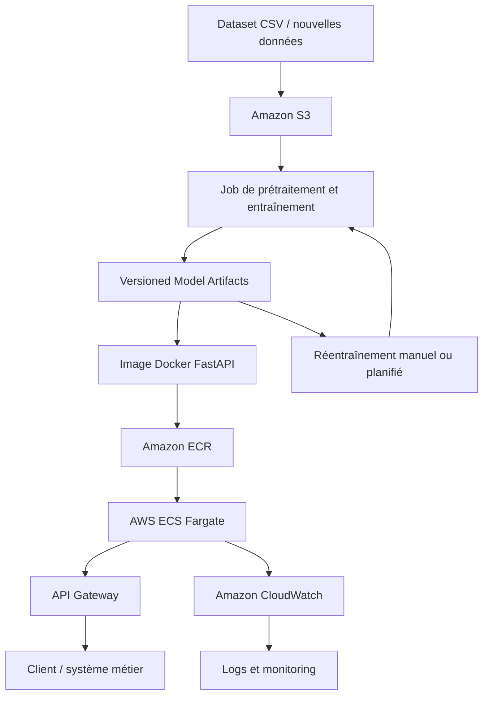

# Prédiction des ruptures de stock


## 1. Problématique d'affaires


Une chaîne de distribution alimentaire québécoise souhaite anticiper les ruptures de stock sur ses produits (SKUs) critiques avec un horizon de prévision de trois jours.


Les ruptures de stock peuvent entraîner des pertes de ventes, une diminution de la satisfaction client et des impacts opérationnels importants. L'objectif est donc d'identifier les situations à risque suffisamment tôt afin de permettre aux équipes d'approvisionnement et d'exploitation de prendre des mesures préventives avant qu'une rupture ne survienne.


Le problème est formulé comme une tâche de classification binaire :


* 1 : une rupture de stock surviendra dans les trois prochains jours ;

* 0 : aucune rupture de stock n'est attendue dans cet horizon.


Compte tenu de la faible maturité technique de l'équipe cliente, la solution proposée doit être :


* robuste ;

* reproductible ;

* documentée ;

* facilement maintenable ;

* simple à déployer et à exploiter.


Dans ce contexte, l'objectif du projet est de construire un pipeline complet de Machine Learning couvrant :


* l'analyse exploratoire des données (EDA) ;

* le prétraitement des données ;

* l'entraînement du modèle ;

* l'évaluation selon des métriques alignées avec les objectifs métier ;

* l'exposition du modèle via une API REST ;

* la conteneurisation avec Docker ;

* une proposition d'architecture cloud pour le déploiement en production.


## 2. Présentation du jeu de données


Le jeu de données fourni contient environ 36 500 observations couvrant l'année 2024.


Le dataset couvre :


* 20 SKUs ;

* 5 magasins ;

* 365 jours d'observation.


Le nombre théorique d'observations est donc :


20 × 5 × 365 = 36 500 lignes


Une observation correspond à l'état d'un SKU dans un magasin donné à une date donnée.


Les variables disponibles sont les suivantes :


| Variable         | Description                       |

| ---------------- | --------------------------------- |

| date             | Date d'observation                |

| sku_id           | Identifiant du produit            |

| store_id         | Identifiant du magasin            |

| sales_qty        | Quantité vendue durant la journée |

| stock_level      | Niveau de stock en fin de journée |

| promotion_flag   | Indicateur de promotion (0/1)     |

| temperature      | Température extérieure            |

| day_of_week      | Jour de la semaine (0 = lundi)    |

| stock_risk_score | Score de risque de rupture        |

| stockout_next_3d | Variable cible                    |


Les variables `sku_id` et `store_id` sont des variables catégorielles. Leur stratégie d'encodage sera déterminée lors de l'étape de prétraitement.


La variable `stock_risk_score` semble représenter un indicateur synthétique du risque de rupture. Son utilisation éventuelle sera analysée plus en détail lors de l'étude du risque de data leakage.


La variable cible `stockout_next_3d` indique si une rupture de stock surviendra dans les trois prochains jours :


* 1 : une rupture de stock est attendue dans les trois prochains jours ;

* 0 : aucune rupture de stock n'est attendue dans cet horizon.


Le problème est donc formulé comme une tâche de classification binaire visant à prédire le risque de rupture de stock à court terme à partir des informations disponibles au moment de l'observation.


## 3. Analyse exploratoire des données (EDA)


L'analyse exploratoire a été réalisée à l'aide d'un script Python dédié permettant d'inspecter la structure du dataset, les types de données, les valeurs manquantes, les doublons, les distributions et les risques potentiels de fuite de données.


Les observations présentées dans les sections suivantes sont basées sur les résultats obtenus lors de cette exploration.


### 3.1 Contenu du jeu de données


Que contient le dataset ?


#### Observations


Le dataset contient 36 500 observations et 10 variables.


La taille du dataset est cohérente avec la structure annoncée :


* 20 SKUs ;

* 5 magasins ;

* 365 jours d'observation.


Le nombre théorique d'observations est donc :


20 × 5 × 365 = 36 500 lignes


Les variables se répartissent en plusieurs catégories :


* variable temporelle : `date` ;

* variables catégorielles : `sku_id`, `store_id` ;

* variable ordinale : `day_of_week` ;

* variables numériques : `sales_qty`, `stock_level`, `temperature`, `stock_risk_score` ;

* variable cible : `stockout_next_3d`.

* variable binaire : `promotion_flag`.


Les colonnes `sales_qty` et `temperature` contiennent déjà des valeurs manquantes qui seront analysées plus en détail dans une section dédiée.


La colonne `date` est actuellement stockée au format texte (`string`). Sa conversion éventuelle sera traitée lors de l'étape de prétraitement.


#### Décisions


* Conserver l'ensemble des variables pour l'analyse exploratoire ;

* Reporter l'analyse détaillée des valeurs manquantes à la section dédiée ;

* Reporter les transformations de types de données à l'étape de prétraitement.


#### Justification


Cette première étape vise principalement à comprendre la structure générale du dataset et à vérifier sa cohérence avec les informations fournies dans l'énoncé avant d'entreprendre les analyses de qualité des données et la préparation du modèle.


### 3.2 Cohérence de la structure des données


#### Observations


La cohérence structurelle du dataset a été vérifiée à partir de la clé métier :


`date + sku_id + store_id`


Cette clé représente l'état d'un produit donné (SKU) dans un magasin donné à une date donnée.


Les contrôles effectués montrent que :


* le dataset couvre 365 dates distinctes ;

* le dataset contient 20 SKUs distincts ;

* le dataset contient 5 magasins distincts ;

* toutes les valeurs de la colonne `date` peuvent être converties correctement au format datetime ;

* aucun doublon n'a été détecté sur la clé métier.


Le nombre théorique d'observations attendu est :


365 × 20 × 5 = 36 500 lignes


Ce total correspond exactement au nombre d'observations présentes dans le dataset.


De plus, le nombre de combinaisons uniques de la clé métier est également égal à 36 500, ce qui confirme que chaque observation est unique et que la granularité des données est cohérente avec le problème métier.


#### Décisions


* Conserver l'ensemble des observations ;

* Utiliser `date + sku_id + store_id` comme clé métier de référence pour les contrôles de qualité de données ;

* Ne supprimer aucune ligne, aucun doublon n'ayant été identifié.


#### Justification


La structure du dataset est conforme aux hypothèses métier décrites dans l'énoncé. Chaque ligne représente une observation unique d'un SKU dans un magasin pour une journée donnée.


L'absence de doublons et la cohérence entre le nombre théorique et le nombre réel d'observations confirment l'intégrité structurelle du dataset. Aucune correction n'est donc nécessaire avant de poursuivre l'analyse exploratoire.


### 3.3 Valeurs manquantes


#### Observations


L'analyse des valeurs manquantes révèle la présence de données absentes dans deux variables :


| Variable | Valeurs manquantes | Pourcentage |

|-----------|------------------:|------------:|

| sales_qty | 1 825 | 5,0 % |

| temperature | 1 825 | 5,0 % |


Aucune valeur manquante n'a été détectée dans les colonnes critiques :


* `date`

* `sku_id`

* `store_id`

* `stockout_next_3d`


Les valeurs manquantes concernent donc uniquement des variables explicatives utilisées pour l'entraînement du modèle.


L'analyse par date ne montre pas de concentration complète des valeurs manquantes sur une journée précise. Les dates les plus touchées contiennent entre 16 et 19 observations manquantes, ce qui suggère une dispersion des valeurs manquantes plutôt qu'une absence complète de données pour une date donnée.


Par ailleurs, les variables `sales_qty` et `temperature` présentent exactement le même nombre de valeurs manquantes. Cette observation suggère que les deux variables pourraient être affectées par un même mécanisme de collecte ou de génération des données. Cette hypothèse sera prise en compte lors des étapes de prétraitement et de modélisation.


#### Décisions


* Conserver l'ensemble des observations ;

* Ne supprimer aucune ligne du dataset ;

* Évaluer différentes stratégies de traitement des valeurs manquantes lors de l'étape de prétraitement ;

* Préserver les colonnes critiques intactes puisqu'aucune donnée n'y est manquante.


#### Justification


Les valeurs manquantes représentent seulement 5 % des observations et ne concernent ni la variable cible ni les identifiants métier utilisés pour définir chaque observation.


Compte tenu de leur faible proportion, supprimer les lignes concernées entraînerait une perte d'information inutile. Une stratégie de traitement adaptée permettra de conserver l'intégralité des données disponibles tout en limitant l'impact des valeurs manquantes sur les performances du modèle.


Aucune correction n'est appliquée à ce stade de l'analyse exploratoire. Le choix de la stratégie de traitement sera réalisé lors de l'étape de prétraitement.


### 3.4 Valeurs invalides et valeurs aberrantes


#### Observations


Une vérification des règles métier n'a révélé aucune valeur invalide dans le dataset.


Les contrôles effectués montrent notamment :


* aucune quantité vendue négative ;

* aucun niveau de stock négatif ;

* aucune valeur invalide dans `promotion_flag` ;

* aucune valeur invalide dans `stockout_next_3d` ;

* aucune valeur invalide dans `day_of_week`.


Une analyse complémentaire des valeurs aberrantes a été réalisée à l'aide de la méthode de l'écart interquartile (IQR).


| Variable         | Valeurs aberrantes détectées |

| ---------------- | ---------------------------: |

| sales_qty        |                          263 |

| stock_level      |                            0 |

| temperature      |                          241 |

| stock_risk_score |                        5 248 |


Les valeurs extrêmes observées dans `sales_qty` demeurent plausibles d'un point de vue métier et peuvent correspondre à des pics de demande réels.


La variable `temperature` présente en revanche plusieurs valeurs très élevées. Les températures maximales observées atteignent 63 °C et de nombreuses observations dépassent largement les seuils habituellement observés dans le contexte québécois.


La variable `stock_risk_score` présente un nombre particulièrement élevé de valeurs identifiées comme aberrantes par la méthode IQR. Cette situation semble davantage liée à la distribution spécifique de la variable qu'à la présence d'erreurs de données et fera l'objet d'une analyse complémentaire dans la section consacrée au risque de fuite de données (data leakage).


#### Décisions


* Ne supprimer aucune observation à ce stade ;

* Conserver les valeurs extrêmes observées dans `sales_qty` ;

* Conserver temporairement les valeurs extrêmes de `temperature` en attendant une analyse plus approfondie ;

* Reporter l'analyse détaillée de `stock_risk_score` à la section dédiée au data leakage.


#### Justification


Les méthodes statistiques permettent d'identifier des observations inhabituelles mais ne suffisent pas, à elles seules, à conclure à une erreur de données.


Dans un contexte de prévision des ruptures de stock, certaines valeurs extrêmes peuvent correspondre à des situations métier réelles et contenir une information pertinente pour le modèle.


Toute décision de correction ou d'exclusion sera donc prise uniquement après validation du contexte métier et analyse complémentaire des variables concernées.


### 3.5 Distribution de la variable cible


#### Observations


La variable cible `stockout_next_3d` est une variable binaire indiquant si une rupture de stock survient dans les trois prochains jours.


La distribution observée est la suivante :


| Classe | Signification | Nombre d'observations | Pourcentage |

| ------ | ------------------------------------------- | --------------------: | ----------: |

| 0 | Aucune rupture attendue | 31 275 | 85,68 % |

| 1 | Rupture attendue dans les 3 prochains jours | 5 225 | 14,32 % |


La classe majoritaire représente 85,68 % du dataset.


Le jeu de données présente un déséquilibre de classes, les situations de rupture de stock étant nettement moins fréquentes que les situations normales.


#### Décisions


* Ne pas utiliser l'accuracy comme métrique principale d'évaluation ;

* Privilégier des métriques adaptées au déséquilibre de classes, notamment le recall, la précision, le F1-score et la matrice de confusion ;

* Porter une attention particulière à la classe positive `1`, car elle correspond au risque métier que le modèle doit détecter.


#### Justification


Dans ce contexte métier, prédire correctement les ruptures de stock est plus important que maximiser simplement le taux global de bonnes prédictions.


Un modèle qui prédirait systématiquement la classe majoritaire obtiendrait une accuracy élevée d'environ 85,68 %, tout en étant incapable de détecter les ruptures de stock.


Le déséquilibre de la cible justifie donc l'utilisation de métriques centrées sur la capacité du modèle à identifier les cas de rupture, en particulier le recall de la classe positive et le F1-score.


### 3.6 Patterns et relations entre les variables


#### Observations


Une analyse des relations entre les variables explicatives et la variable cible a été réalisée à l'aide de corrélations et de comparaisons de groupes.


Les corrélations observées avec la variable cible sont les suivantes :


| Variable | Corrélation avec la cible |

|-----------|-------------------------:|

| sales_qty | 0,1117 |

| stock_level | -0,5478 |

| temperature | -0,0032 |

| stock_risk_score | 0,9996 |


La variable `stock_level` présente la relation la plus forte parmi les variables explicatives directement liées aux opérations, avec une corrélation de -0,5478.


Les observations associées à une rupture présentent un niveau de stock moyen de 3,87 unités, contre 86,86 unités pour les observations sans rupture. Cette relation est cohérente avec le phénomène métier étudié : plus le niveau de stock est faible, plus le risque de rupture augmente.


La variable `sales_qty` présente une corrélation positive plus faible (0,1117) avec la cible. Les observations associées à une rupture affichent en moyenne un volume de ventes légèrement supérieur à celles ne présentant pas de rupture.


La variable `temperature` présente une corrélation très faible avec la cible (-0,0032), ce qui suggère une contribution limitée à la prédiction des ruptures dans ce dataset.


La variable `stock_risk_score` présente une corrélation extrêmement élevée avec la variable cible (0,9996). Une telle relation apparaît inhabituelle dans un contexte réel et constitue un signal fort nécessitant une analyse spécifique du risque de fuite de données (*data leakage*).


L'analyse des variables catégorielles met également en évidence plusieurs patterns intéressants :


* les produits en promotion présentent un taux de rupture de 18,71 %, contre 13,52 % pour les produits non promus ;

* certains produits présentent davantage de ruptures que d'autres, avec des taux variant de 11,89 % à 15,89 % selon le SKU ;

* les différences observées entre magasins demeurent relativement faibles ;

* l'effet du jour de la semaine apparaît limité mais reste potentiellement exploitable par le modèle.


#### Décisions


* Conserver provisoirement l'ensemble des variables ;

* Investiguer spécifiquement la variable `stock_risk_score` dans la section consacrée au risque de *data leakage* ;

* Considérer `stock_level` comme une variable potentiellement très informative pour la modélisation ;

* Conserver les variables catégorielles (`promotion_flag`, `sku_id`, `store_id`, `day_of_week`) afin de permettre au modèle de capturer d'éventuels comportements spécifiques aux produits ou aux magasins.


#### Justification


L'objectif de cette étape est d'identifier les variables susceptibles de contribuer à la prédiction des ruptures de stock.


Les résultats obtenus montrent que plusieurs variables présentent des relations cohérentes avec le phénomène métier étudié, notamment le niveau de stock et les promotions. Ces variables apparaissent comme des candidates naturelles pour la phase de modélisation, sous réserve des conclusions de l'analyse du risque de *data leakage*.


Toutefois, la corrélation presque parfaite observée pour `stock_risk_score` soulève un risque important de fuite de données qui devra être évalué avant toute phase d'entraînement afin d'éviter une surestimation artificielle des performances du modèle.


### 3.7 Cohérence temporelle


#### Observations


Une vérification de la cohérence temporelle a été réalisée afin d'identifier d'éventuelles dates manquantes ou des ruptures dans la série chronologique.


Les résultats obtenus sont les suivants :


| Indicateur                |     Valeur |

| ------------------------- | ---------: |

| Première date observée    | 2024-01-01 |

| Dernière date observée    | 2024-12-30 |

| Nombre de dates observées |        365 |

| Nombre de dates attendues |        365 |

| Dates manquantes          |          0 |


Le dataset couvre donc l'ensemble de la période observée sans interruption.


Une analyse complémentaire du taux mensuel de rupture a également été réalisée. Les taux observés varient entre 13,29 % et 15,27 % selon les mois.


Ces variations restent relativement limitées et ne mettent pas en évidence de saisonnalité forte ou d'anomalie temporelle évidente dans le dataset.


#### Décisions


* Conserver l'intégralité des observations temporelles ;

* Utiliser la variable `date` pour réaliser les séparations temporelles entre les jeux d'entraînement et de test ;

* Ne réaliser aucune correction spécifique liée à la continuité temporelle des données.


#### Justification


Le dataset présente une couverture temporelle complète sur la période étudiée et ne contient aucune date manquante.


Cette continuité est particulièrement importante dans le contexte d'un problème de prévision à horizon de trois jours, car elle garantit la cohérence des analyses temporelles et des futures stratégies de validation.


Par ailleurs, l'analyse mensuelle du taux de rupture ne révèle aucune anomalie ou saisonnalité suffisamment marquée pour nécessiter un traitement spécifique à ce stade de l'étude.


### 3.8 Analyse du risque de fuite de données (Data Leakage)


#### Observations


Une analyse spécifique a été réalisée sur la variable `stock_risk_score` en raison de sa corrélation exceptionnellement élevée avec la variable cible.


La corrélation observée entre `stock_risk_score` et `stockout_next_3d` est de 0,9996, soit une relation presque parfaite.


L'analyse des distributions par classe met également en évidence une séparation quasi complète entre les observations associées à une rupture et celles ne présentant pas de rupture :


| Classe             | Intervalle observé du stock_risk_score |

| ------------------ | -------------------------------------- |

| 0 (pas de rupture) | -0,037 à 0,041                         |

| 1 (rupture)        | 0,951 à 1,028                          |


Les valeurs observées pour les deux classes ne présentent pratiquement aucun chevauchement.


Cette situation suggère fortement que la variable `stock_risk_score` incorpore directement ou indirectement une information liée à la variable cible ou à des événements futurs.


#### Décisions


* Exclure `stock_risk_score` du jeu de variables utilisé pour l'entraînement ;

* Conserver cette variable uniquement à des fins d'analyse exploratoire ;

* Construire et évaluer les modèles sans utiliser cette variable.


#### Justification


L'objectif du modèle est de prédire les ruptures futures à partir des informations réellement disponibles au moment de la prédiction.


Lorsqu'une variable contient déjà une information directement liée à la cible, les performances mesurées deviennent artificiellement élevées et ne reflètent plus la capacité réelle du modèle à généraliser sur de nouvelles données.


Compte tenu de la corrélation observée et de la séparation quasi parfaite des distributions, `stock_risk_score` est considéré comme une source potentielle de fuite de données (*data leakage*) et est exclu de la phase de modélisation par mesure de prudence.


## 4. Prétraitement des données


L'analyse exploratoire a permis d'identifier plusieurs éléments importants pour la préparation des données :


* présence de valeurs manquantes dans `sales_qty` et `temperature` ;

* déséquilibre de la variable cible ;

* présence de variables catégorielles nécessitant un encodage ;

* risque potentiel de data leakage associé à `stock_risk_score`.


Les étapes de prétraitement décrites dans cette section visent à préparer les données pour l'entraînement des modèles tout en tenant compte des conclusions de l'analyse exploratoire.


### 4.1 Suppression des variables à risque de data leakage


#### Observations


L'analyse exploratoire a mis en évidence un risque potentiel de fuite de données (*data leakage*) associé à la variable `stock_risk_score`.


Cette variable présente une corrélation quasi parfaite avec la variable cible (0,9996) ainsi qu'une séparation presque complète entre les classes positives et négatives, ce qui constitue un indicateur fort de fuite de données potentielle.


Son utilisation lors de l'entraînement pourrait conduire à une surestimation artificielle des performances du modèle.


#### Décisions


* Supprimer la variable `stock_risk_score` avant toute autre étape de prétraitement ;

* Conserver uniquement les variables disponibles dans un contexte réaliste de prédiction ;

* Sauvegarder une nouvelle version du dataset sans la variable à risque.


#### Justification


L'objectif du modèle est de prédire les ruptures de stock futures à partir des informations réellement disponibles au moment de la prédiction.


L'utilisation d'une variable susceptible de contenir directement ou indirectement l'information cible compromettrait la validité de l'évaluation du modèle.


Par mesure de prudence, `stock_risk_score` est exclue du pipeline de modélisation afin de garantir une évaluation réaliste des performances du modèle sur de nouvelles données.


#### Résultats


| Contrôle                   | Résultat |

| -------------------------- | -------- |

| Colonnes avant suppression | 10       |

| Colonnes supprimées        | 1        |

| Colonnes après suppression | 9        |

| Statut du contrôle         | PASS     |


Le dataset prétraité a été sauvegardé dans :


```text

data/processed/stocks_no_leakage.csv

```


#### Test effectué


Test ID : PREP-001


Nom : `test_stock_risk_score_removed`


Objectif :

Vérifier que la variable identifiée comme source potentielle de data leakage est supprimée avant la modélisation.


Résultat attendu :

La colonne `stock_risk_score` n'est plus présente dans le dataset traité.


Résultat obtenu :

PASS.


### 4.2 Traitement des valeurs manquantes


#### Observations


Les variables `sales_qty` et `temperature` contenaient chacune 1 825 valeurs manquantes, soit 5 % du dataset.


Aucune valeur manquante n'était présente dans la variable cible ni dans les colonnes critiques utilisées pour identifier les observations.


#### Décisions


* Imputer `sales_qty` avec la médiane du SKU correspondant ;

* Utiliser une médiane globale en fallback si nécessaire ;

* Imputer `temperature` avec la médiane globale ;

* Valider qu'aucune valeur manquante ne subsiste après traitement.


#### Justification


`sales_qty` dépend fortement du produit vendu. Une imputation par SKU permet de préserver les différences de comportement entre produits tout en restant simple et maintenable.


La médiane a été privilégiée à la moyenne car elle est plus robuste aux valeurs extrêmes.


`temperature` présente une relation très faible avec la cible dans l'EDA. Une imputation par médiane globale constitue donc une stratégie simple, robuste et reproductible.


#### Résultats


| Variable      | Avant imputation | Après imputation |

| ------------- | ---------------: | ---------------: |

| `sales_qty`   |            1 825 |                0 |

| `temperature` |            1 825 |                0 |


La médiane globale utilisée pour `temperature` est 15,10.


Le dataset prétraité a été sauvegardé dans :


```text

data/processed/stocks_preprocessed.csv

```


#### Test effectué


Test ID : PREP-002


Nom : `test_missing_values_imputed`


Objectif :

Vérifier que toutes les valeurs manquantes sont correctement traitées lors du prétraitement.


Résultat attendu :

Aucune valeur manquante ne subsiste dans les variables `sales_qty` et `temperature`.


Résultat obtenu :

PASS.


### 4.3 Encodage des variables catégorielles


#### Observations


Les variables `sku_id` et `store_id` sont des variables catégorielles nominales.


Elles représentent respectivement les produits et les magasins du dataset et ne possèdent aucun ordre naturel.


Le dataset contient :


| Variable | Nombre de catégories |

| -------- | -------------------: |

| sku_id   |                   20 |

| store_id |                    5 |


#### Décisions


* Utiliser le One-Hot Encoding pour `sku_id` ;

* Utiliser le One-Hot Encoding pour `store_id` ;

* Apprendre les catégories uniquement à partir du jeu d'entraînement ;

* Encoder les catégories inconnues observées en inférence sous forme de vecteurs nuls afin de garantir la robustesse du pipeline face à de nouvelles catégories non observées durant l'entraînement.


#### Justification


Le Label Encoding aurait introduit un ordre artificiel entre les catégories.


Le One-Hot Encoding permet de représenter chaque catégorie indépendamment sans créer de relation numérique inexistante entre les produits ou les magasins.


Compte tenu du faible nombre de catégories observées, l'augmentation du nombre de colonnes reste limitée et ne présente aucun problème de performance.


L'apprentissage des catégories uniquement sur le jeu d'entraînement permet également d'éviter toute fuite d'information depuis le jeu de test.


#### Résultats


| Contrôle                  | Résultat |

| ------------------------- | -------- |

| Nombre de SKU appris      | 20       |

| Nombre de magasins appris | 5        |

| Colonnes avant encodage   | 9        |

| Colonnes après encodage   | 32       |

| Statut                    | PASS     |


#### Test effectué


Test ID : PREP-003


Nom : `test_one_hot_encoding`


Objectif :

Vérifier que les variables catégorielles sont correctement encodées et supprimées après transformation.


Résultat attendu :

Les colonnes `sku_id` et `store_id` n'existent plus après prétraitement.


Résultat obtenu :

PASS.


\---


### 4.4 Ingénierie des variables temporelles


#### Observations


La variable `date` contient une information temporelle potentiellement utile pour la prédiction des ruptures de stock.


Certaines variations saisonnières ou calendaires peuvent influencer la demande et les niveaux de stock.


#### Décisions


* Extraire l'année ;

* Extraire le mois ;

* Extraire le jour du mois ;

* Extraire le numéro du jour dans l'année ;

* Supprimer la variable `date` après création des nouvelles variables.


#### Justification


La plupart des algorithmes de Machine Learning ne peuvent pas exploiter directement une variable de type date.


La création de variables temporelles permet de transformer l'information chronologique en variables numériques directement utilisables lors de l'entraînement.


Les variables temporelles sont générées après la séparation train/test afin d'éviter toute fuite d'information liée au futur.


#### Résultats


Variables créées :


* `year`

* `month`

* `day`

* `day_of_year`


Variable supprimée :


* `date`


#### Test effectué


Test ID : PREP-004


Nom : `test_temporal_feature_engineering`


Objectif :

Vérifier que les variables temporelles sont correctement créées à partir de la date.


Résultat attendu :

Les variables `year`, `month`, `day` et `day_of_year` sont présentes et la colonne `date` est supprimée.


Résultat obtenu :

PASS.


\---


### 4.5 Séparation temporelle Train / Test


#### Observations


Le problème étudié est un problème de prédiction temporelle.


L'utilisation d'un échantillonnage aléatoire pourrait introduire une fuite d'information entre les données passées et futures.


#### Décisions


* Réaliser une séparation chronologique ;

* Utiliser les 80 % premières dates observées pour l'entraînement ;

* Utiliser les 20 % dernières dates observées pour les tests ;

* Effectuer la séparation sur les dates uniques afin d'éviter qu'une même journée soit présente dans les deux jeux ;

* Interdire tout chevauchement temporel entre les jeux.


#### Justification


Dans un contexte réel, un modèle est entraîné sur des données historiques puis utilisé pour prédire des événements futurs.


Une séparation temporelle permet de reproduire fidèlement ce scénario et d'obtenir une estimation plus réaliste des performances du modèle.


#### Résultats


| Contrôle            | Valeur     |

| ------------------- | ---------- |

| Lignes train        | 29 200     |

| Lignes test         | 7 300      |

| Dernière date train | 2024-10-18 |

| Première date test  | 2024-10-19 |

| Chevauchement       | Aucun      |


#### Test effectué


Test ID : PREP-005


Nom : `test_temporal_split`


Objectif :

Vérifier que les données d'entraînement précèdent toujours les données de test.


Résultat attendu :

La date maximale du train est strictement inférieure à la date minimale du test.


Résultat obtenu :

PASS.


\---


### 4.6 Validation finale et sauvegarde des jeux de données


#### Observations


Une validation finale a été réalisée afin de garantir l'intégrité des données avant la phase d'entraînement.


#### Décisions


* Vérifier l'absence de valeurs manquantes ;

* Vérifier l'absence de variables de fuite de données ;

* Vérifier l'absence de variables catégorielles non encodées ;

* Vérifier que toutes les variables sont numériques ;

* Vérifier la présence de la variable cible ;

* Vérifier la cohérence des schémas train et test.


#### Justification


Ces contrôles permettent de sécuriser la phase d'entraînement et d'éviter des erreurs de modélisation, d'évaluation ou de déploiement.


Ils garantissent également que les données produites par le pipeline sont directement exploitables par les algorithmes de Machine Learning.


#### Résultats


| Contrôle                    | Train | Test |

| --------------------------- | ----- | ---- |

| Valeurs manquantes          | 0     | 0    |

| Colonnes non numériques     | 0     | 0    |

| Variable cible présente     | Oui   | Oui  |

| Schéma identique train/test | Oui   | Oui  |

| Validation finale           | PASS  | PASS |


Dimensions finales :


| Dataset | Lignes | Colonnes |

| ------- | -----: | -------: |

| Train   | 29 200 |       35 |

| Test    |  7 300 |       35 |


Fichiers générés :


```text

data/processed/train_preprocessed.csv

data/processed/test_preprocessed.csv

data/processed/preprocessing_params.json

```


### Artefacts générés durant le prétraitement


| Fichier | Description |

|----------|-------------|

| `stocks_no_leakage.csv` | Dataset après suppression de la variable présentant un risque de fuite de données |

| `stocks_preprocessed.csv` | Dataset complet après traitement des valeurs manquantes |

| `train_preprocessed.csv` | Jeu d'entraînement final utilisé pour l'entraînement des modèles |

| `test_preprocessed.csv` | Jeu de test final utilisé pour l'évaluation |

| `preprocessing_params.json` | Paramètres de prétraitement sauvegardés pour l'inférence |


#### Test effectué


Test ID : PREP-006


Nom : `test_final_dataset_validation`


Objectif :

Vérifier que les jeux de données sont prêts pour l'entraînement.


Résultat attendu :

Tous les contrôles de validation sont réussis.


Résultat obtenu :

PASS.


#### Synthèse


À l'issue du prétraitement, les jeux d'entraînement et de test ne contiennent plus de valeurs manquantes, ne présentent aucun risque identifié de fuite de données et possèdent un schéma strictement identique, garantissant la reproductibilité de la phase d'entraînement.


## 5. Sélection et entraînement du modèle


### 5.1 Choix du modèle


Deux modèles ont été retenus pour comparaison :


* Logistic Regression ;

* Random Forest Classifier.


### Justification du choix des modèles


Le problème consiste à prédire un risque de rupture de stock à un horizon de trois jours à partir d'un dataset de taille modérée (\~36 500 observations).


Le volume de données disponible reste compatible avec des modèles supervisés classiques, ce qui permet de privilégier des solutions simples, robustes et maintenables.


La Logistic Regression constitue un modèle de référence robuste, rapide à entraîner, simple à interpréter et facile à maintenir.


Les coefficients du modèle permettent d'expliquer directement l'influence des variables sur la probabilité de rupture, ce qui facilite l'adoption de la solution par une équipe peu expérimentée en Machine Learning.


Le Random Forest Classifier permet quant à lui de capturer des relations non linéaires et des interactions entre variables sans nécessiter un important travail d'optimisation d'hyperparamètres.


Il constitue également une référence classique et robuste pour les problèmes de classification sur données tabulaires. Il offre généralement de meilleures performances que les modèles linéaires lorsque les relations entre les variables deviennent plus complexes.


### Modèles considérés mais non retenus


Des algorithmes de gradient boosting tels que XGBoost, LightGBM ou CatBoost ont également été considérés.


Ces modèles obtiennent souvent d'excellentes performances sur les données tabulaires. Toutefois, dans le contexte de ce projet, la priorité n'est pas uniquement la performance prédictive maximale.


Le mandat précise qu'une équipe data peu mature devra maintenir la solution après son déploiement.


Le choix a donc été orienté vers des modèles plus simples à comprendre, documenter, expliquer et réentraîner, tout en conservant un niveau de performance attendu suffisant pour ce volume de données et cet horizon de prévision.


### Adéquation avec le contexte du projet


| Critère                            | Logistic Regression | Random Forest |

| ---------------------------------- | ------------------- | ------------- |

| Horizon de prévision de 3 jours    | Adapté              | Adapté        |

| Volume de données (\~36 500 lignes) | Adapté              | Adapté        |

| Interprétabilité                   | Très élevée         | Moyenne       |

| Facilité de maintenance            | Très élevée         | Élevée        |

| Complexité opérationnelle          | Faible              | Faible        |

| Risque de sur-ingénierie           | Très faible         | Faible        |


### Critères de comparaison


Les modèles seront comparés selon les métriques suivantes :


* Recall de la classe positive ;

* Precision ;

* F1-score ;

* ROC-AUC ;

* Matrice de confusion ;

* Simplicité de maintenance et d'interprétation.


Une attention particulière sera portée au Recall de la classe positive, car le coût métier d'une rupture de stock est considéré comme supérieur au coût d'une fausse alerte.


L'objectif principal est donc d'identifier le plus grand nombre possible de situations à risque avant qu'une rupture ne survienne.


Le modèle retenu ne sera pas nécessairement celui obtenant la meilleure performance brute, mais celui offrant le meilleur compromis entre performance prédictive, robustesse, interprétabilité et maintenabilité dans le contexte opérationnel du client.


### 5.2 Gestion du déséquilibre de classes


### Observations


L'analyse exploratoire a montré que la variable cible présente un déséquilibre modéré :


| Classe             | Nombre d'observations | Pourcentage |

| ------------------ | --------------------: | ----------: |

| 0 (pas de rupture) |                31 275 |     85,68 % |

| 1 (rupture)        |                 5 225 |     14,32 % |


Dans ce contexte, un modèle entraîné sans précaution particulière pourrait privilégier la classe majoritaire et sous-détecter les situations de rupture de stock.


### Décisions


Afin d'évaluer l'impact du déséquilibre de classes sur les performances, deux variantes de chaque modèle seront entraînées :


\- Version standard ;

\- Version avec `class_weight="balanced"` ;


Les modèles évalués sont donc :


\- Logistic Regression ;

\- Logistic Regression (`class_weight="balanced"`) ;

\- Random Forest Classifier ;

\- Random Forest Classifier (`class_weight="balanced"`).


### Justification


L'option class_weight="balanced" ajuste automatiquement les poids associés aux classes en fonction de leur fréquence d'apparition dans les données d'entraînement, afin de réduire le biais potentiel en faveur de la classe majoritaire.


Cette approche ne modifie pas les données d'origine et ne nécessite aucune opération de sur-échantillonnage (oversampling) ou de sous-échantillonnage (undersampling).


Elle constitue une solution simple, robuste et directement intégrée aux algorithmes utilisés.


L'entraînement des deux variantes permettra de mesurer concrètement l'impact de cette stratégie sur la capacité du modèle à détecter les ruptures de stock.


### Critères de sélection


Le choix final du modèle ne sera pas basé uniquement sur l'accuracy.


Compte tenu du contexte métier, le coût d'une rupture de stock est considéré comme supérieur au coût d'une fausse alerte.


Le Recall de la classe positive constitue donc une métrique particulièrement importante, puisqu'il mesure la capacité du modèle à détecter les ruptures de stock avant qu'elles ne surviennent.


Toutefois, un Recall très élevé peut parfois être obtenu au prix d'un nombre excessif de fausses alertes. Afin de conserver un compromis équilibré entre la détection des ruptures et le contrôle des faux positifs, le F1-score est utilisé comme critère principal de sélection.


Le processus de sélection suivra donc l'ordre de priorité suivant :


1\. F1-score ;

2\. Recall de la classe positive ;

3\. Precision ;

4\. ROC-AUC ;

5\. Simplicité de maintenance et d'interprétation.


L'objectif principal est de maximiser la capacité du modèle à identifier les ruptures de stock avant qu'elles ne surviennent tout en conservant un niveau acceptable de faux positifs.


### Modèles à comparer


| ID | Modèle                                               |

| -- | ---------------------------------------------------- |

| M1 | Logistic Regression                                  |

| M2 | Logistic Regression (`class_weight="balanced"`)      |

| M3 | Random Forest Classifier                             |

| M4 | Random Forest Classifier (`class_weight="balanced"`) |


Les performances de ces quatre modèles seront comparées dans la section d'évaluation afin de sélectionner la solution offrant le meilleur compromis entre performance prédictive, robustesse, interprétabilité et maintenabilité.


### 5.3 Résultats de l'entraînement


### Résultats obtenus


Les quatre modèles candidats ont été entraînés par training.py, qui s'appuie sur le module evaluation.py pour calculer les métriques utilisées lors de la comparaison des modèles.


| Modèle                                               | Accuracy | Precision |  Recall | F1-score | ROC-AUC |

| ---------------------------------------------------- | -------: | --------: | ------: | -------: | ------: |

| Logistic Regression                                  |  99,10 % |   99,20 % | 94,49 % |  96,79 % |  0,9975 |

| Logistic Regression (`class_weight="balanced"`)      |  94,75 % |   73,57 % | 99,24 % |  84,50 % |  0,9980 |

| Random Forest Classifier                             |  99,07 % |   98,33 % | 95,15 % |  96,71 % |  0,9990 |

| Random Forest Classifier (`class_weight="balanced"`) |  98,70 % |   94,43 % | 96,67 % |  95,54 % |  0,9991 |


### Analyse des résultats


L'utilisation de class_weight="balanced" a permis d'améliorer le Recall de la classe positive, ce qui était attendu compte tenu du déséquilibre observé dans la variable cible.


Toutefois, cette amélioration s'est accompagnée d'une diminution importante de la Precision, particulièrement pour la Logistic Regression.


Par exemple :


| Modèle                                          | Faux positifs | Faux négatifs |

| ----------------------------------------------- | ------------: | ------------: |

| Logistic Regression                             |             8 |            58 |

| Logistic Regression (`class_weight="balanced"`) |           375 |             8 |


Le modèle équilibré permet donc de détecter davantage de ruptures de stock, mais au prix d'un nombre beaucoup plus élevé de fausses alertes.


Dans un contexte opérationnel, chaque fausse alerte peut entraîner des vérifications supplémentaires, des ajustements inutiles des stocks ou des commandes préventives non nécessaires.


### Sélection du modèle final


Bien que la Logistic Regression avec class_weight="balanced" obtienne le meilleur Recall (99,24 %), cette amélioration s'accompagne d'une augmentation importante du nombre de faux positifs.


La Logistic Regression standard conserve un Recall élevé (94,49 %) tout en offrant :


\- la meilleure Precision (99,20 %) ;

\- le meilleur F1-score global (96,79 %) ;

\- un nombre très limité de fausses alertes ;

\- une excellente interprétabilité ;

\- une maintenance simplifiée pour l'équipe cliente.


Par ailleurs, les performances obtenues par le Random Forest Classifier sont très proches de celles de la Logistic Regression sans apporter d'amélioration significative.


Le modèle final est sélectionné automatiquement selon le meilleur F1-score observé sur le jeu de test.


Lors de l'exécution réalisée dans le cadre de ce projet, la Logistic Regression standard a obtenu le meilleur F1-score et a donc été retenue comme modèle final.


### Modèle retenu


| Critère            | Valeur              |

| ------------------ | ------------------- |

| Modèle sélectionné | Logistic Regression |

| Accuracy           | 99,10 %             |

| Precision          | 99,20 %             |

| Recall             | 94,49 %             |

| F1-score           | 96,79 %             |

| ROC-AUC            | 0,9975              |


## 6. API FastAPI et packaging du modèle


Le modèle retenu est exposé via une API HTTP développée avec FastAPI.


L'API charge au démarrage :


* le modèle entraîné : `models/best_model.joblib` ;

* les paramètres de prétraitement : `data/processed/preprocessing_params.json` ;

* les métadonnées d'entraînement : `models/training_metadata.json`.


Avant chaque prédiction, l'API applique les mêmes transformations que celles utilisées lors de l'entraînement : imputation des valeurs manquantes, encodage des variables catégorielles, création des variables temporelles et alignement des colonnes attendues par le modèle.


### Endpoints exposés


| Endpoint   | Méthode | Description                                   |

| ---------- | ------- | --------------------------------------------- |

| `/health`  | GET     | Vérifie que l'API est prête                   |

| `/predict` | POST    | Retourne la prédiction de rupture sur 3 jours |


### GET /health


Réponse obtenue :


```json

{

 "status": "ok"

}

```


### POST /predict


Exemple de payload :


```json

{

 "instances": [

   {

     "date": "2024-12-15",

     "sku_id": "SKU_001",

     "store_id": "STORE_1",

     "sales_qty": 25,

     "stock_level": 10,

     "promotion_flag": 0,

     "temperature": 5.0,

     "day_of_week": 6

   }

 ]

}

```


Réponse obtenue :


```json

{

 "predictions": [

   {

     "prediction": 1,

     "probability": 0.9077017586631138

   }

 ]

}

```


### Interprétation


La valeur `prediction = 1` indique qu'une rupture de stock est prédite dans les trois prochains jours.


La valeur `probability = 0.9077` indique que le modèle estime ce risque à environ 90,77 %.


### Validation


L'API a été testée localement avec Uvicorn sur le port 8000.


```bash

uvicorn src.api:app --reload --port 8000

```


Les endpoints `/health`, `/docs` et `/predict` ont été validés avec succès.


## 7. Tests automatisés


Des tests automatisés ont été implémentés avec `pytest` afin de valider les composants les plus critiques du pipeline de prétraitement.


L'objectif n'était pas de tester chaque instruction individuellement, mais de sécuriser les transformations susceptibles d'avoir un impact direct sur la qualité des données, les performances du modèle ou la validité de l'évaluation.


Les tests couvrent notamment :


* la prévention des fuites de données (*data leakage*) ;

* la cohérence de la séparation temporelle ;

* le traitement des valeurs manquantes ;

* l'encodage des variables catégorielles ;

* la gestion des catégories inconnues ;

* la création des variables temporelles ;

* la cohérence du pipeline complet de prétraitement.


### Principaux tests unitaires


| Test                                                                | Risque couvert                                                                                                         | Résultat |

| ------------------------------------------------------------------- | ---------------------------------------------------------------------------------------------------------------------- | -------- |

| `test_remove_leakage_features_removes_stock_risk_score`             | Vérifie que la variable `stock_risk_score` est supprimée avant l'entraînement afin d'éviter toute fuite de données     | PASS     |

| `test_temporal_split_train_before_test`                             | Vérifie que les observations du jeu d'entraînement sont strictement antérieures à celles du jeu de test                | PASS     |

| `test_handle_missing_values_uses_train_params_only`                 | Vérifie que les paramètres d'imputation sont appris uniquement sur le jeu d'entraînement puis appliqués au jeu de test | PASS     |

| `test_encode_categorical_features_handles_unknown_categories`       | Vérifie la gestion correcte des catégories inconnues lors de l'inférence                                               | PASS     |

| `test_engineer_temporal_features_removes_date_and_creates_features` | Vérifie la création des variables temporelles et la suppression de la colonne `date`                                   | PASS     |


### Test d'intégration principal


| Test                                                                | Objectif                                                                                                                                    | Résultat |

| ------------------------------------------------------------------- | ------------------------------------------------------------------------------------------------------------------------------------------- | -------- |

| `test_full_preprocessing_pipeline_train_and_test_have_valid_schema` | Vérifie l'exécution complète du pipeline de prétraitement ainsi que la cohérence du schéma final produit pour l'entraînement et l'inférence | PASS     |


### Exécution des tests


Les tests peuvent être exécutés depuis la racine du projet à l'aide de la commande suivante :


```bash

python -m pytest

```


### Résultat obtenu


Au total, 10 tests automatisés ont été exécutés avec succès.


```text

============================= test session starts =============================


platform win32 -- Python 3.11.9, pytest-9.1.1


collected 10 items


tests/test_pipeline.py ......                                  [60%]

tests/test_preprocessing.py ....                               [100%]


============================== 10 passed in 0.54s ==============================

```


### Justification


Ces tests permettent de détecter rapidement toute régression introduite lors d'une modification future du pipeline de prétraitement, notamment les fuites de données, les incohérences temporelles, les erreurs d'encodage ou les problèmes d'imputation susceptibles d'affecter les performances du modèle.


Les tests unitaires valident individuellement les transformations les plus sensibles, tandis que le test d'intégration vérifie le bon fonctionnement du pipeline complet de bout en bout.


Ils constituent une première couche de contrôle qualité automatisé garantissant que les transformations appliquées aux données restent cohérentes avec les hypothèses retenues lors des phases d'analyse, de préparation des données et de modélisation.


Cette approche contribue à améliorer la robustesse du pipeline, à faciliter sa maintenance future et à réduire le risque de régressions lors des évolutions du projet.


## 8. Docker


L'application a été conteneurisée avec Docker afin de garantir la reproductibilité de l'environnement d'exécution et de faciliter son déploiement sur différents environnements.


La conteneurisation permet d'encapsuler l'ensemble des dépendances nécessaires au fonctionnement du pipeline de prédiction et de l'API FastAPI dans une image unique et portable.


### Construction de l'image


```bash

docker build -t stockout-api:test .

```


### Exécution du conteneur


```bash

docker run -p 8000:8000 stockout-api:test

```


Une fois le conteneur démarré, l'API est accessible à l'adresse suivante :


```text

http://localhost:8000

```


La documentation interactive générée automatiquement par FastAPI est disponible à :


```text

http://localhost:8000/docs

```


### Validation du conteneur


Les vérifications suivantes ont été réalisées avec succès dans l'environnement Docker :


* démarrage de l'application ;

* chargement du modèle sauvegardé ;

* chargement des paramètres de prétraitement ;

* exécution complète du pipeline de prétraitement ;

* disponibilité de l'endpoint `/health` ;

* disponibilité de l'endpoint `/predict` ;

* génération de prédictions à partir de nouvelles observations.


### Exemple de réponse


```json

{

 "predictions": [

   {

     "prediction": 1,

     "probability": 0.9077

   }

 ]

}

```


### Résultat


L'ensemble des validations a été exécuté avec succès dans le conteneur.


Cette étape confirme que l'application peut être exécutée dans un environnement isolé et reproductible sans dépendre de la configuration de la machine hôte, tout en conservant un comportement identique à celui observé durant les phases de développement et de test.


La solution est ainsi prête à être déployée sur une infrastructure cloud ou une plateforme d'orchestration de conteneurs.


## 9. Structure du projet


Le projet est organisé de manière modulaire afin de séparer clairement les différentes étapes du cycle de vie du modèle : analyse exploratoire, prétraitement, entraînement, validation, déploiement et documentation.


```text

stockout-prediction/

│

├── data/

│   ├── raw/                     # Données brutes

│   └── processed/               # Données prétraitées et paramètres

│

├── docs/                        # Documentation complémentaire

│

├── models/

│   ├── best_model.joblib

│   ├── logistic_regression.joblib

│   ├── logistic_regression_balanced.joblib

│   ├── random_forest.joblib

│   ├── random_forest_balanced.joblib

│   └── training_metadata.json

│

├── scripts/

│   └── check.py      # Validation automatisée du projet

│

├── src/

│   ├── api.py                   # API FastAPI

│   ├── eda.py                   # Analyse exploratoire

│   ├── evaluation.py            # Calcul des métriques d'évaluation

│   ├── preprocessing.py         # Pipeline de prétraitement

│   ├── training.py              # Entraînement et sélection du modèle

│   └── __init__.py

│

├── tests/

│   ├── test_preprocessing.py

│   └── test_pipeline.py

│

├── Dockerfile                   # Conteneur Docker

├── Makefile                     # Commandes d'automatisation

├── requirements.txt             # Dépendances Python

├── README.md                    # Documentation du projet

└── .gitignore                   # Fichiers exclus du dépôt

  


```            


### Description des principaux composants


| Composant              | Description                                                                                                         |

| ---------------------- | ------------------------------------------------------------------------------------------------------------------- |

| `data/raw/`            | Contient le jeu de données original fourni pour le projet                                                           |

| `data/processed/`      | Contient les jeux de données prétraités ainsi que les paramètres de prétraitement sauvegardés pour l'inférence      |

| `models/`              | Contient les modèles candidats évalués durant l'entraînement ainsi que le modèle final retenu (`best_model.joblib`) |

| `src/eda.py`           | Réalise l'analyse exploratoire des données et documente les décisions prises                                        |

| `src/preprocessing.py` | Implémente le pipeline complet de prétraitement des données                                                         |

| `src/training.py`      | Entraîne les modèles, compare leurs performances et sélectionne automatiquement le meilleur modèle selon le F1-score|

| `src/evaluation.py`    | Calcule les métriques d'évaluation : Accuracy, Precision, Recall, F1-score, ROC-AUC, PR-AUC et matrice de confusion |

| `src/api.py`           | Expose le modèle final via une API REST FastAPI                                                                     |

| `tests/`               | Contient les tests unitaires et les tests d'intégration du pipeline                                                 |

| `Dockerfile`           | Permet la conteneurisation et le déploiement reproductible de l'application                                         |

| `Makefile`             | Regroupe les principales commandes d'exécution, de test et de déploiement du projet                                 |

| `scripts/check.py`     | Exécute une validation automatisée du projet (structure, documentation, Docker, API et tests)                       |

| `requirements.txt`     | Liste des dépendances nécessaires à l'exécution du projet                                                           |


Cette structure favorise la séparation des responsabilités entre les différentes composantes du système et facilite la compréhension du projet.


Elle améliore également la lisibilité, la maintenabilité et la réutilisabilité du code en isolant clairement les étapes d'analyse, de préparation des données, d'entraînement, de validation et de déploiement.


Enfin, cette organisation permet de reproduire l'ensemble du pipeline de manière cohérente, depuis les données brutes jusqu'au service d'inférence exposé via l'API, tout en facilitant les évolutions futures de la solution.


## 10. Installation


### Prérequis


Les outils suivants doivent être installés sur la machine :


* Python 3.11 ou supérieur ;

* Git ;

* Docker (optionnel pour l'exécution conteneurisée).


### Cloner le dépôt


```bash

git clone <repository-url>

cd stockout-prediction

```


### Créer un environnement virtuel


#### Windows


```bash

python -m venv .venv

.venv\\Scripts\\activate

```


#### Linux / macOS


```bash

python -m venv .venv

source .venv/bin/activate

```


### Installer les dépendances


```bash

pip install --upgrade pip

pip install -r requirements.txt

```


### Vérification de l'installation


Les tests automatisés peuvent être exécutés afin de vérifier que l'environnement est correctement configuré :


```bash

python -m pytest

```


Résultat attendu :


```text

============================== 10 passed ==============================

```


### Validation de l'environnement


Une fois les dépendances installées et les tests validés, l'environnement est prêt pour :


* l'exécution de l'analyse exploratoire ;

* le prétraitement des données ;

* l'entraînement des modèles ;

* le lancement de l'API FastAPI ;

* l'exécution de l'application dans Docker.


L'ensemble du pipeline peut alors être reproduit localement ou exécuté dans un environnement conteneurisé via Docker.


## 11. Exécution du projet


Le projet est conçu comme un pipeline séquentiel composé de plusieurs étapes indépendantes. Chaque étape produit les artefacts nécessaires à l'étape suivante, ce qui facilite la compréhension du système, le débogage et la maintenance.


Cette approche a été retenue afin de privilégier la simplicité opérationnelle et la transparence du processus, conformément au contexte du projet et à la faible maturité technique de l'équipe cliente.


### Vue d'ensemble du pipeline


```text


EDA

↓

Preprocessing

↓

Training  + Evaluation + Model Selection

↓

FastAPI

↓

Docker

↓

Project Validation

```


### 1. Analyse exploratoire des données


```bash

python src/eda.py

```


Cette étape permet de :


* analyser la structure du dataset ;

* détecter les valeurs manquantes ;

* identifier les valeurs aberrantes ;

* évaluer la distribution de la variable cible ;

* détecter les risques potentiels de fuite de données ;

* documenter les décisions de préparation des données.


Artefact produit :


* documentation des analyses et décisions dans le README.


\---


### 2. Prétraitement des données


```bash

python src/preprocessing.py

```


Cette étape applique l'ensemble des transformations nécessaires avant l'entraînement :


* suppression des variables présentant un risque de fuite de données ;

* séparation temporelle entre les jeux d'entraînement et de test ;

* traitement des valeurs manquantes ;

* encodage des variables catégorielles ;

* création des variables temporelles ;

* validation finale du schéma des données.


Artefacts produits :


```text

data/processed/train_preprocessed.csv

data/processed/test_preprocessed.csv

data/processed/preprocessing_params.json

```


\---


### 3. Entraînement des modèles


```bash

python src/training.py

```


Cette étape :


* entraîne les modèles candidats ;

* évalue leurs performances à l'aide du module `evaluation.py` ;

* compare les résultats obtenus ;

* sélectionne automatiquement le meilleur modèle selon le F1-score ;

* sauvegarde les artefacts nécessaires à l'inférence.


Artefacts produits :


```text

models/best_model.joblib

models/logistic_regression.joblib

models/logistic_regression_balanced.joblib

models/random_forest.joblib

models/random_forest_balanced.joblib

models/training_metadata.json

```


### 4. Évaluation des modèles


Le module `src/evaluation.py` centralise le calcul des métriques utilisées pour évaluer et comparer les modèles entraînés.


Il est utilisé par `training.py` durant la phase d'entraînement afin de calculer les métriques servant à la sélection du modèle final.


Ce module est responsable du calcul des métriques utilisées pour comparer les modèles :


* Accuracy ;

* Precision ;

* Recall ;

* F1-score ;

* ROC-AUC ;

* PR-AUC ;

* matrice de confusion.


Les résultats d'évaluation sont enregistrés dans :


```text

models/training_metadata.json

```


### 5. Sélection du modèle final


Une fois l'évaluation terminée, les modèles sont comparés automatiquement.


Le modèle présentant le meilleur F1-score sur le jeu de test est retenu comme modèle final.


Le modèle sélectionné est sauvegardé dans :


```text

models/best_model.joblib

```


Les métadonnées de sélection ainsi que l'ensemble des métriques sont conservées dans :


```text

models/training_metadata.json

```


### 6. Lancement de l'API FastAPI


```bash

uvicorn src.api:app --reload

```


Une fois démarrée, l'API est accessible à :


```text

http://localhost:8000

```


Documentation interactive :


```text

http://localhost:8000/docs

```


Au démarrage, l'API charge automatiquement :


* le modèle final ;

* les paramètres de prétraitement ;

* les métadonnées d'entraînement.


Les mêmes transformations que celles utilisées lors de l'entraînement sont appliquées avant chaque prédiction afin de garantir la cohérence entre les phases d'entraînement et d'inférence.


\---


### 7. Déploiement via Docker


#### Construction de l'image


```bash

docker build -t stockout-api:test .

```


#### Exécution du conteneur


```bash

docker run -p 8000:8000 stockout-api:test

```


L'API devient alors accessible à :


```text

http://localhost:8000

```


\---


### 8. Vérification du projet


```bash

python scripts/check.py

```


Cette commande exécute automatiquement une série de contrôles portant sur :


* la structure du projet ;

* la présence des fichiers et artefacts requis ;

* la cohérence de la documentation ;

* la configuration Docker ;

* l'import de l'application FastAPI ;

* l'exécution des tests automatisés.


Une exécution réussie produit le rapport suivant :


```text

=== Project Validation ===


Checking: Required files and folders

PASSED


Checking: README sections

PASSED


Checking: requirements.txt dependencies

PASSED


Checking: Dockerfile

PASSED


Checking: FastAPI import

PASSED


Checking: pytest

PASSED


=== Validation Summary ===

Project validation passed successfully.

```


Cette étape permet de valider rapidement l'intégrité globale du projet avant une livraison, un déploiement ou une mise en production.


\---


### Vérification du service


#### Endpoint de santé


```http

GET /health

```


Réponse attendue :


```json

{

 "status": "ok"

}

```


#### Endpoint de prédiction


```http

POST /predict

```


Ce service permet de soumettre une ou plusieurs observations et de récupérer :


* la prédiction de rupture de stock ;

* la probabilité associée à cette prédiction.


\---


### Justification de l'approche retenue


Aucun mécanisme d'orchestration complexe n'a été introduit dans cette version du projet.


Compte tenu du volume de données, de la fréquence d'exécution attendue et de la faible maturité technique de l'équipe cliente, une exécution séquentielle reposant sur des scripts indépendants a été privilégiée.


Cette approche présente plusieurs avantages :


* réduction de la complexité opérationnelle ;

* facilité de compréhension du pipeline ;

* débogage simplifié ;

* maintenance facilitée ;

* reproductibilité complète du processus de préparation et d'entraînement.


Dans un contexte de production à plus grande échelle, cette architecture pourrait évoluer vers une orchestration automatisée à l'aide d'outils tels qu'Airflow, Prefect ou AWS Step Functions.


## 12. Architecture Cloud


Le projet a été développé et validé localement, mais son architecture a été conçue pour pouvoir être déployée progressivement sur une plateforme cloud.


L'objectif n'est pas de proposer une architecture complexe, mais une solution robuste, maintenable et cohérente avec le niveau de maturité technique de l'équipe cliente.


### Architecture cible proposée




### Composants principaux


| Composant                              | Rôle                                                                            |

| -------------------------------------- | ------------------------------------------------------------------------------- |

| `Amazon S3`                            | Stockage des données brutes, des données prétraitées et des artefacts du modèle |

| `Job de prétraitement et entraînement` | Exécution du pipeline de préparation des données et de réentraînement du modèle |

| `Versioned Model Artifacts`            | Stockage versionné du modèle final et des métadonnées d'entraînement            |

| `Amazon ECR`                           | Stockage des images Docker                                                      |

| `AWS ECS Fargate`                      | Exécution du conteneur FastAPI sans gestion directe de serveur                  |

| `API Gateway`                          | Exposition sécurisée de l'API de prédiction                                     |

| `Amazon CloudWatch`                    | Collecte des logs, surveillance du service et suivi des erreurs                 |


### Flux de déploiement


1\. Les données sont déposées dans `Amazon S3`.

2\. Le pipeline de prétraitement et d'entraînement est exécuté.

3\. Le modèle final et ses métadonnées sont sauvegardés comme artefacts versionnés.

4\. L'API FastAPI est empaquetée dans une image Docker.

5\. L'image Docker est poussée vers `Amazon ECR`.

6\. Le service est déployé sur `AWS ECS Fargate`.

7\. Les requêtes de prédiction transitent via `API Gateway`.

8\. Les logs et métriques opérationnelles sont centralisés dans `CloudWatch`.


### Stratégie de réentraînement


Dans cette version, le réentraînement peut être déclenché manuellement ou selon une fréquence planifiée.


Une approche simple consiste à relancer périodiquement le pipeline lorsque de nouvelles données historiques sont disponibles, puis à comparer les performances du nouveau modèle avec celles du modèle actuellement déployé avant toute mise en production.


Cette stratégie permet de conserver une approche compréhensible et maintenable tout en posant les bases d'un futur processus de réentraînement automatisé.


### Justification de l'architecture


Cette architecture repose principalement sur des services managés afin de limiter la complexité opérationnelle.


L'utilisation d'`AWS ECS Fargate` permet d'exécuter l'API conteneurisée sans gérer directement l'infrastructure serveur. `Amazon S3` centralise les données et les artefacts, tandis que `Amazon ECR` facilite le stockage et le déploiement des images Docker.


Cette proposition couvre les besoins essentiels d'un projet MLOps :


* stockage des données ;

* préparation et entraînement du modèle ;

* gestion des artefacts ;

* exposition du service d'inférence ;

* monitoring ;

* réentraînement du modèle.


L'architecture reste volontairement simple afin de conserver une solution réaliste, maintenable et adaptée au contexte du projet.


### Évolutions possibles


Si le volume de données, la fréquence de réentraînement ou le trafic de l'API augmentaient significativement, cette architecture pourrait évoluer progressivement vers :


* une orchestration automatisée avec AWS Step Functions ;

* un pipeline CI/CD dédié au déploiement des modèles ;

* un registre de modèles spécialisé ;

* un mécanisme de surveillance de la dérive des données (*data drift*) et des performances du modèle ;

* une automatisation complète du processus de réentraînement.


Ces composants n'ont pas été retenus dans la version actuelle afin de limiter la complexité opérationnelle et de rester cohérent avec les besoins du projet ainsi qu'avec la maturité technique de l'équipe cliente.


## Conclusion


Le projet a permis de développer une solution complète de prévision des ruptures de stock couvrant l'ensemble du cycle de vie d'un modèle de Machine Learning : analyse exploratoire, prétraitement, entraînement, évaluation, exposition via API, tests automatisés, conteneurisation et proposition d'architecture cloud.


La Logistic Regression a été retenue comme modèle final en raison de son excellent compromis entre performance, interprétabilité et simplicité de maintenance dans le contexte métier étudié.


